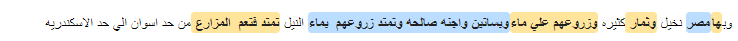

# diffViewer

Link: https://kitab-project.org/diffViewer/

This app displays the differences between two strings of characters.
Contrary to most other diff viewers, it is geared towards comparing texts
rather than code, especially texts from the [OpenITI corpus](https://github.com/OpenITI)
and text reuse date created by [passim](https://github.com/dasmiq/passim) for the
[KITAB project](https://kitab-project.org).

The diff viewer leverages the [wikEd diff library](https://en.wikipedia.org/wiki/User:Cacycle/diff)
developed for Wikipedia (javascript code [here](https://en.wikipedia.org/wiki/User:Cacycle/diff.js)).
This library does not only detect text that was added or deleted, but also
text that was moved from one place to another.

The diffViewer modifies the output from the wikEd tool in two ways:

* the wikEd tool displays the differences between two texts in one
  composite text rather than side-by-side.
  
  The diffViewer analyses the output of the wikEd tool and displays the
  result side by side:
  

* the wikEd tool seems to have difficulties with Arabic's prefixes
(for example, if text A has *wa-faʿala* and text B *fa-faʿala*, both words would be
marked as different). The diffViewer adds a refining step of the wikEd
output to deal with this issue (in the example above, only *wa-* and *fa-* would
be marked).

## App Usage

There are two basic ways to use the diff viewer:

  * You can paste two texts to compare into the two text fields,
    and click the "Display diff" button
    (if you don't have two texts ready, you can also load an example by clicking
    the "example" link in the header);

  * Alternatively, you can click the "Upload from file" button to upload a passim
    output tsv file.
    - This will open a popup with a button that allows you to select
      a tsv file from your own computer.
    - Once loaded (this may take a while for large files), you can select the rows
      you want to display.
    - You can use a search filter to select rows: e.g., writing "كتاب" in the
      filter field and hitting the Enter key will filter out only rows in which at
      least one of the texts contain the word "kitāb". The filter accepts regular
      expressions: typing كتا?ب will select rows that contain either *kitāb*
      or *kutub/kataba/...* . You can also filter on milestone ids (e.g., "ms1\d\d"
      will select only milestones between 100 and 199).
    - Once you have selected the rows you are interested in, click the
      "Load selected rows" button to display the diff for each row.

## Color scheme

Text that is common between both input texts is displayed without highlighting;
text that is unique to the left-hand text ("text A") is highlighted in blue,
text that is unique to the right-hand text ("text B") is highlighted in green,
while text that is common to both texts but appears in a different place is
highlighted in orange.


## Options

Click the "Options" button to view the options:

* by default, all OpenITI tags and punctuation are removed from the input texts,
since they don't belong to the original texts; you can uncheck the OpenITI tags
and punctuation checkboxes if you don't want to remove these.
* by default, Arabic text is normalized to some extent:
  - alifs with and without hamza / madda
  - alif maqṣūra and final yā'
  - tā marbūṭa and final hā'
* the wikEd output is refined by Heckel's algorithm (Paul Heckel, "A Technique
for Isolating Differences Between Files", Programming Techniques 21/4, 1978),
using shingled character n-grams (that is, breaking down the string into
overlapping sequences of "n" characters; e.g., the string "this is an example"
can be broken down into the following shingled character 10-grams: "this is an",
"his is an ", "is is an e", "s is an ex", " is an exa", "is an exam", "s an examp",
" an exampl", "an example"). By default, trigrams are used, but the user can
change the size of the n-grams.
* to make the output more easily readable, the string can be broken down into
lines, each of which starts with text that both input texts have in common.
You can decide the minimum number of shared characters to be displayed on each line
before splitting the text (the default is 20).
* the inline wikEd output optionally can be displayed below the side-by-side view.

The options can be reset to their defaults by clicking the "Reset options" button.

## Resizing the output and downloading image files

You can resize the width of the output table by grabbing and dragging the
right-side border of the table.

The font size can be changed by clicking the "Options" button.

Once you are happy with the size of the table and the font, you can download the
output as a png image (most useful for use in printed documents) or as an svg
image (most useful for online publication, as it allows unlimited zooming) using
the "Download png" and "Download svg" buttons.

If you uploaded multiple text pairs using the tsv upload function, you can
download png or svg images for all files at once using the "Download all as png"
and "Download all as svg" buttons.

## Note on SVG and PNG output

* SVG, being an XML format, has a problem with Arabic text:
if a tag is inserted between two Arabic letters that should be connected,
the connection between the letters is broken.
This can be avoided by inserting a zero-width-joiner character on both sides of the tag.
The DiffViewer uses a patched version of the `dom-to-image.js` library
that is modified to add such characters in the relevant locations
(see https://github.com/tsayen/dom-to-image/issues/391).

* The `dom-to-image.js` library also had a problem with the height of the
table rows and cells in cases where the diff texts are split into multiple lines:
the height of the cells was set to a much higher value than necessary.
The svg output of the `makeSvgDataUri()` function in the `dom-to-image.js` library
was adapted to manually set the height and of table, tbody, tr and td elements
to `auto` (setting this in the css was found not to be a solution).

## Importing the javascript library to build your own app

The kitabDiff javascript library can also be used separately to build your own app:

  - Copy the following kitabDiff.js file and its dependencies into your project folder:
    * `kitabDiff.js`
    * `openITI.js`
    * `wikEdDiff.js`
  - import the `kitabDiff` function into your javascript:
    ```
    import { kitabDiff } from "./kitabDiff.js"
    ```
  - call the `kitabDiff` function with the two strings you want to compare:
    ```
    let [wikEdDiffHtml, aHtml, bHtml] = await kitabDiff(strA, strB, refine_n=3);
    ```
    The function returns three strings:
    * the first contains the raw output from wikEdDiff (a single compound string),
    * the second contains the text of the first input string with span tags marking deletions/insertions and transpositions
    * the third contains the text of the second input string with span tags marking deletions/insertions and transpositions
  - for better readability of the diff, it is possible to split the diff into fragments
    that can be displayed in parallel; set the `intoRows` parameter to `true`
    and define the minimum shared Arabic-script characters before a line can be broken (`arChars`):
    ```
    let [wikEdDiffHtml, aHtml, bHtml] = await kitabDiff(strA, strB, intoRows=true, arChars=20, refine_n=3);
    ```
    The `aHtml` and `bHtml` strings will now contain a splitter "###NEW_ROW###"
    that can be used to, for example, display each fragment in a separate table row:
    ```
    let aHtmlSplit = aHtml.split("###NEW_ROW###");
    let bHtmlSplit = bHtml.split("###NEW_ROW###");
    for (let i=0; i<aHtmlSplit.length; i++) {
      let a = aHtmlSplit[i];
      let b = bHtmlSplit[i];
      // add the html to the output:
      let newRow = document.getElementById("outputTable").insertRow(-1);
      let cellA = newRow.insertCell(0);
      cellA.innerHTML = a; //aHtml;
      let cellB = newRow.insertCell(1);
      cellB.innerHTML = b; //bHtml;
      }
    }
    ```


## TO DO:

* the output should be further refined (in the color scheme example above,
  for example, *wa-qawm* and *wa-qawmuhu* are highlighted as entirely different
  while there is only one letter different)
* do not split words in multi-line modus
* find a good way to create svg files; the current solutions (dom-to-image, html-to-image)
  use foreignobject in svg to inject the html - such svgs cannot be viewed or edited
  in graphical programs.